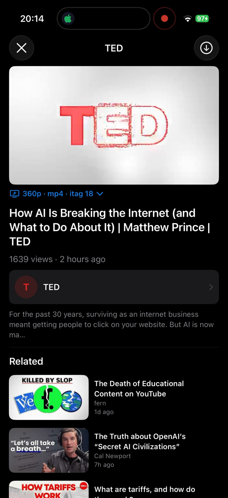
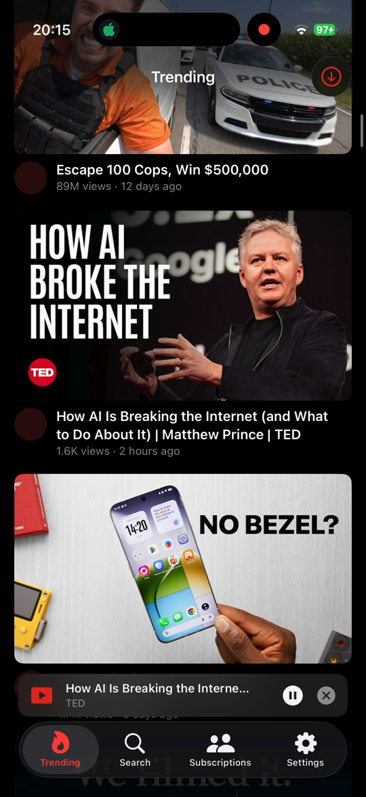

# iPipe

A Swift/SwiftUI port of the [NewPipe](https://newpipe.net) YouTube client. Pure Swift, zero third-party dependencies, iOS 18+, Swift 5.

> **Disclaimer**: An experimental personal project. Not affiliated with Google or YouTube. For private/research use only — respect YouTube's Terms of Service in any real deployment.

## Screenshots

<p>
  
  
</p>

## Installing

iPipe ships as an **unsigned** IPA (every Release on the Releases page, and as an artifact on each build). Because it's unsigned you need to sign it with your own Apple ID before it will run on a device. Two common ways:

### Sign it yourself
1. Download `iPipe-unsigned.ipa` from the latest [Release](https://github.com/msx98/iPipe/releases).
2. Sign and install with your own certificate — e.g. with [AltStore](https://altstore.io), [Sideloadly](https://sideloadly.io), [SideStore](http://sidestore.io), or `codesign` + a provisioning profile on the command line.
3. In iOS Settings → General → VPN & Device Management (or *Profiles & Device Management*), trust your developer certificate before the first launch.

### Or use Feather

[Feather](https://feather.cf) is an on-device signing app: download `iPipe-unsigned.ipa`, open it in Feather, add your certificates under *Certificates & Profiles*, and it will sign + install directly.

### Simulator (no signing needed)
The build itself runs fine unsigned on a simulator:

```sh
make ARCH=simulator install   # builds and installs into the booted simulator
```

## Features

- **Trending** feed, **Search** (with suggestions + All/Videos/Channels/Playlists filters), **Subscriptions**, and **Settings** tabs
- Full **video detail/player** screen — metadata, description, related videos, and a quality picker
- **Downloads** — video (≤1080p) and audio (itag 140), with per-part progress, saved under `Documents/Downloads/`
- Picture-in-style background audio playback (synthetic HLS manifests via [`HLSResourceLoader`/`HLSBuilder`](iPipe/Core/Player/PlayerModel.swift))
- Account flows: in-app **Youtube login** (`WKWebView`), cookie import/export, signed request signing
- Interchangeable backend: real **InnerTube** extraction vs an offline **Sample** data source (switch in Settings)
- Deep links: opening `ipipe://<youtube-video-id>` jumps straight into the player

## Requirements

- macOS with Xcode (iOS 26.x SDK works; deployment target is iOS 18)
- A booted simulator (`ARCH=simulator`) or a paired iPhone (`ARCH=device`)
- Connected iPhone installs need ad-hoc/sideload signing (see note below) if not jailbroken

## Build & install

The Makefile drives everything; unsigned builds only.

```sh
make build                  # Release unsigned build into build/app/<ARCH>/
make install                # device install (devicectl)
make ARCH=simulator install # simulator install (simctl into booted sim)
make launch                 # launch on the chosen target
make clean                  # remove build/
```

`make build` smart-skips rebuilding when the git tree is clean and `BUNDLE_ID` is unchanged, so the inner loop is just `make ARCH=simulator install` → launch.

### Configuration (env vars)

| Var | Default | Purpose |
|---|---|---|
| `ARCH` | `device` | `device` or `simulator` |
| `SIM` | `booted` | simctl device for simulator builds |
| `DEVICE` / `UDID_IPHONE` | `iPhone` | devicectl target name or UDID (`make install UDID_IPHONE=<udid>`) |
| `BUNDLE_ID` | `ax.lx.ipipe` | App bundle identifier override |
| `TEAM_ID` | `A1111ABCDE` | Developer team id fed to build + the runtime `TEAM_ID` Info.plist key (keychain group `<TEAM_ID>.ax.lx.ipipe`) |
| `COOKIESFILE` | *(empty)* | Push a cookies file into the app's `Documents/` after install (imported on next launch then deleted) |

Example:

```sh
make ARCH=simulator install COOKIESFILE=./cookies.txt UDID_IPHONE=00008150-xxxxxxxxxxxx
```

## Project layout

```
iPipe/                    iOS Swift source (the app)
  Core/                     app state, models, extraction, services, player, theme
  Features/                 one screen per folder (Trending, Search, Subscriptions, VideoDetail, Channel, Settings, Downloads)
  Shared/Components/        reusable SwiftUI views
iPipe.xcodeproj/          single-target Xcode project
tools/push_cookies.py     house_arrest cookie delivery for real devices
Makefile                  build / install / launch pipeline
```

Key entry points: `iPipe/iPipeApp.swift` (`@main`), `iPipe/ContentView.swift` (root 4-tab `TabView` + mini player), `iPipe/Core/AppModel.swift` (central `@Observable` state).

## Signing note

This repo builds **unsigned** apps only. `devicectl` (real devices) will reject an unsigned app unless it's a developer-friendly environment; for sideloading onto personal devices you'll want to add your own signing step after `make build` (e.g. embed a provisioning profile + `codesign`). Simulator builds run fine unsigned.

## More docs

- `AGENTS.md` — deeper architecture notes and a simulator debugging workflow.
- `TODO.md` — known issues / roadmap (playback bug, mini-player layout, download UX).