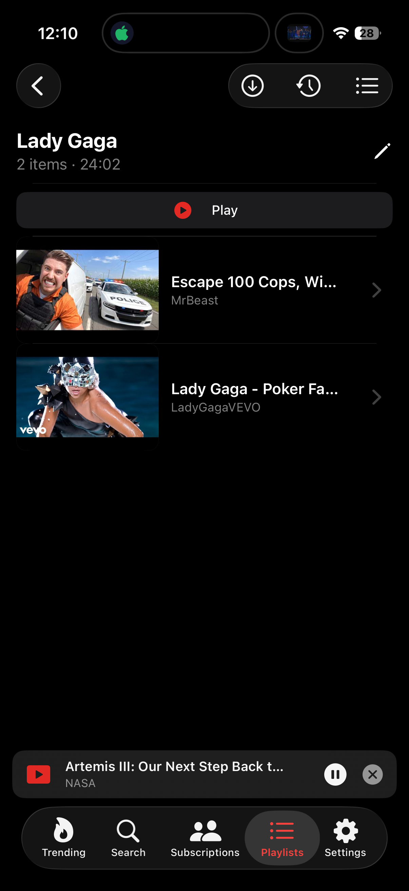

#  iPipe


An iOS YouTube client with background play and more. Pure Swift, zero third-party dependencies, iOS 18+, Swift 5.

[Release Page](../../releases/latest): IPAs are unsigned, but you can use an app like [Feather](../../../../claration/Feather) to sign and install it on your device. Note that sign-ins will only work if you set a keychain access group: $TEAMID.ax.lx.ipipe

> **Disclaimer**: An experimental personal project. Not affiliated with Google or YouTube. For private/research use only — respect YouTube's Terms of Service in any real deployment.

## Screenshots

<p>
  
  
</p>

## Features

- Full **video detail/player** screen — metadata, description, related videos, and a quality picker
- **Downloads** — video (≤1080p) and audio (itag 140), with per-part progress, saved under `Documents/Downloads/`
- **Local playlists** — create, append, reorder, dedupe, remove watched, and play as a sequential queue; share/export as URLs or a YouTube temporary playlist
- Background audio playback
- Account login, cookies.txt import/export
- Planned: Netflix-style PiP video playback

## Build & install

iOS 26.x SDK works, deployment target is iOS 18.

macOS is not needed, you can simply fork this repo, clone, modify and `make release`, the IPA will be generated automatically on your GitHub fork.

Otherwise, Makefile drives everything; unsigned builds only.

```sh
make build                  # Release unsigned build into build/app/<ARCH>/
make install                # device install (devicectl)
make ARCH=simulator install # simulator install (simctl into booted sim)
make launch                 # launch on the chosen target
make clean                  # remove build/
```

`make build` smart-skips rebuilding when the git tree is clean and `BUNDLE_ID` is unchanged, so the inner loop is just `make ARCH=simulator install` → launch.

| Env Var | Default | Purpose |
|---|---|---|
| `ARCH` | `device` | `device` or `simulator` |
| `SIM` | `booted` | simctl device for simulator builds |
| `DEVICE` / `UDID_IPHONE` | `iPhone` | devicectl target name or UDID (`make install UDID_IPHONE=<udid>`) |
| `BUNDLE_ID` | `ax.lx.ipipe` | App bundle identifier override |
| `TEAM_ID` | `A1111ABCDE` | Developer team id fed to build + the runtime `TEAM_ID` Info.plist key (keychain group `<TEAM_ID>.ax.lx.ipipe`) |
| `COOKIESFILE` | *(empty)* | Push a cookies file into the app's `Documents/` after install (imported on next launch then deleted) |

Example:

```sh
make ARCH=simulator install COOKIESFILE=./cookies.txt UDID_IPHONE=00008150-xxxxxxxxxxxx
```

## Project layout

```
iPipe/                    iOS Swift source (the app)
  Core/                     app state, models, extraction, services, player, theme
  Features/                 one screen per folder (Trending, Search, Subscriptions, VideoDetail, Channel, Playlists, Settings, Downloads)
  Shared/Components/        reusable SwiftUI views
iPipe.xcodeproj/          single-target Xcode project
tools/push_cookies.py     house_arrest cookie delivery for real devices
Makefile                  build / install / launch pipeline
```

Key entry points: `iPipe/iPipeApp.swift` (`@main`), `iPipe/ContentView.swift` (root 5-tab `TabView` + mini player), `iPipe/Core/AppModel.swift` (central `@Observable` state).

## Signing note

This repo builds **unsigned** apps only. `devicectl` (real devices) will reject an unsigned app unless it's a developer-friendly environment; for sideloading onto personal devices you'll want to add your own signing step after `make build` (e.g. embed a provisioning profile + `codesign`). Simulator builds run fine unsigned.

## More docs

- `AGENTS.md` — deeper architecture notes and a simulator debugging workflow.
- `TODO.md` — known issues / roadmap (playback bug, mini-player layout, download UX).
